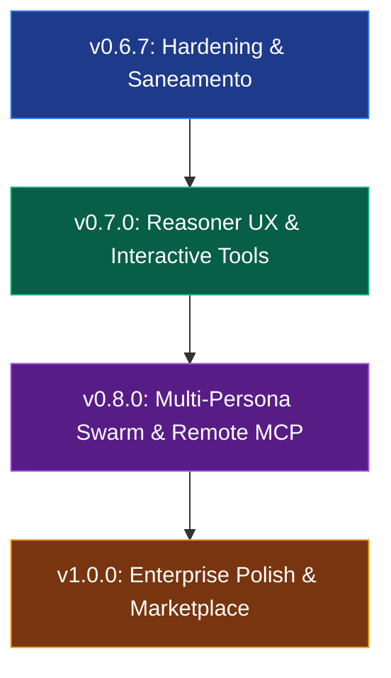

# 🏛️ AG Universal AI — Parecer Geral do Conselho & Roadmap Estratégico

> **Projeto:** `AG Universal AI` (`ag-universal-ai`)  
> **Escopo da Análise:** Auditoria de Arquitetura, Segurança, Performance, Orquestração Agêntica, Frontend Webview, Qualidade/DevOps e Visão de Produto.  
> **Diretriz:** Protocolo Transversal `[dev]` & Cognitive Harness (`Checar -> Refazer -> Recontextualizar -> Refazer -> Rechecar -> Aprovar`).

---

## 📊 1. Sumário Executivo & Scorecard de Maturidade

O **Conselho de Arquitetura e Engenharia de Software** realizou uma varredura minuciosa e multidimensional no estado atual da base de código do **AG Universal AI** (versão `0.6.6`).

O projeto consolidou-se como um assistente de IA multi-provedor (12+ backends locais e em nuvem), com cliente e servidor MCP nativos (JSON-RPC 2.0 via `stdio`), visualizador de diff interativo (`ag-diff://`), completude de código via Ghost Text (FIM), motor agêntico com extração de ferramentas via fallback JSON e interface Webview resiliente com captura de teclado e imagens do clipboard.

### 🎯 Scorecard Dimensional do Conselho

| Dimensão Auditada | Nota (0 a 10) | Status | Parecer Consolidado do Conselho |
| :--- | :---: | :---: | :--- |
| **1. Arquitetura & Design de Sistemas** | **8.8** | 🟢 Sólido | Desacoplamento limpo em camadas. Identificada orfandade parcial de `PlanExecutor` e discrepância de presets no manifesto. |
| **2. Segurança, Zero Trust & Contenção** | **8.4** | 🟡 Bom c/ Ressalvas | `SecretStorage` e contenção de arquivos excelentes. Brechas de sanitização em `cwd` no terminal e `resolveUri` em workspace tools. |
| **3. Performance & Engenharia de Streams** | **8.7** | 🟢 Otimizado | Streaming híbrido (Node/Web) resiliente. Monólogo de raciocínio de modelos Reasoner (DeepSeek R1) necessita de isolamento visual. |
| **4. Orquestração Agêntica & Protocolo MCP** | **8.6** | 🟢 Robusto | Direct MCP Client funcional via `stdio` com binding dinâmico. Falta suporte a transporte remoto (SSE/HTTP) e confirmação interativa de ferramentas. |
| **5. Frontend Webview & UX/DX** | **9.0** | 🟢 Alta Fidelidade | Singleton IPC (`window.__agVscApi`) e rotina de retentativas eliminaram congelamentos. Oportunidade de blocos colapsáveis de pensamento (`<think>`). |
| **6. Qualidade, Testabilidade & DevOps** | **7.9** | 🔴 Alerta | 22 testes passam em 1s e build limpo, mas `npm run lint` quebra devido à incompatibilidade do ESLint 9 (falta de `eslint.config.mjs`). |
| **7. Visão de Produto & Ecossistema** | **9.2** | 🟢 Competitivo | Paridade com Cursor, Cline e Roo Code, oferecendo soberania de privacidade local (Ollama) e suporte a modelos de ponta. |
| **ÍNDICE GERAL DE MATURIDADE (SSOT)** | **8.65 / 10** | 🟢 **PRODUÇÃO COM RECOMENDAÇÕES** |

---

## 🔍 2. Tribunal do Conselho: Auditoria Dimensional Detalhada

### 🏛️ Dimensão 1: Arquitetura de Software & Design de Sistemas
- **Pontos Fortes**:
  - O [`src/extension.ts`](./src/extension.ts) orquestra todas as 12 camadas de forma assíncrona, registrando rigorosamente todas as instâncias em `context.subscriptions`.
  - [`ProviderManager`](./src/providers/provider-manager.ts) atua como SSOT para credenciais, seleção de modelo, métricas de consumo de tokens e fallback automático.
  - [`MCPClientManager`](./src/mcp/client.ts) implementa carregamento desacoplado em segundo plano (`catch` não bloqueante), evitando travamento na inicialização da barra lateral.
- **Problemas & Inconsistências**:
  - **Orfandade de `PlanExecutor`**: A classe [`PlanExecutor`](./src/agent/executor.ts) é instanciada no [`src/extension.ts`](./src/extension.ts), mas nunca é utilizada no fluxo de execução. O comando `runAgent` invoca diretamente `agentEngine.run` passando a descrição em texto.
  - **Desacoplamento do Planner na Webview**: Quando o usuário clica no pill `🤖 Agent` na Webview lateral, o manipulador `handleAgent` invoca `agentEngine.run(goal, 'Use tools to accomplish the goal.')` sem acionar o [`AgentPlanner`](./src/agent/planner.ts).

---

### 🔒 Dimensão 2: Segurança Ofensiva, Defensiva & Zero Trust
- **Pontos Fortes**:
  - Armazenamento em `SecretStorage` nativo do VS Code, com leitura limpa do `.env` local sem persistir dados sensíveis no repositório público.
  - Hardening contra Path Traversal em [`EditTools.resolveUri`](./src/tools/edit-tools.ts) e [`FileTools.resolveUri`](./src/tools/file-tools.ts) com normalização de caminhos e verificação de raiz (`targetPath.startsWith(rootPath)`).
- **Vulnerabilidades Detectadas**:
  - **Falta de Contenção no `cwd` do Terminal**: Em [`TerminalTools.runCommand`](./src/tools/terminal-tools.ts), a interpolação `cwd ? \`\${workspaceRoot}/\${cwd}\` : workspaceRoot` não valida se `cwd` contém sequências como `../../` ou caminhos absolutos para diretórios externos do sistema operacional.
  - **Inconsistência em `WorkspaceTools`**: O método [`WorkspaceTools.resolveUri`](./src/tools/workspace-tools.ts) não executa a checagem de confinamento que existe em `FileTools` e `EditTools`.
  - **Exposição de Caminho Local no Chat Participant**: Em [`ChatParticipant.buildReferencesContext`](./src/chat/participant.ts), utiliza-se `ref.value.fsPath` diretamente no cabeçalho do prompt, expondo o caminho de sistema local em vez do caminho relativo (`vscode.workspace.asRelativePath(ref.value)`).

---

### ⚡ Dimensão 3: Performance, Concorrência & Engenharia de Streams
- **Pontos Fortes**:
  - Suporte duplo a `body.getReader()` e `Symbol.asyncIterator in body` no [`OpenAIAdapter`](./src/providers/openai-adapter.ts), eliminando incompatibilidades entre Electron e Node.js.
  - Propagação de cancelamento instantâneo via `AbortSignal` em requisições de completude inline e streaming.
- **Oportunidades de Melhoria**:
  - **Tratamento de Tokens de Raciocínio (Reasoning)**: Em [`OpenAIAdapter.stream`](./src/providers/openai-adapter.ts), deltas de `reasoning_content` (DeepSeek R1 / Kimi) são concatenados no mesmo fluxo de texto da resposta final, misturando o raciocínio interno com o resultado para o desenvolvedor.
  - **Renderização Incremental de Markdown**: O re-parseamento integral de Markdown a cada chunk SSE na Webview pode causar micro-engasgos visuais em respostas longas com múltiplos blocos de código.

---

### 🤖 Dimensão 4: Orquestração Agêntica, LLMs & Protocolo MCP
- **Pontos Fortes**:
  - O [`AgentEngine`](./src/agent/engine.ts) possui extrator de fallback (`extractToolCallsFromText`) para modelos locais (Ollama / DeepSeek R1) que não suportam function calling nativo no formato OpenAI.
  - Servidor MCP embarcado expõe 9 ferramentas com schemas padronizados em [`src/mcp/tools.ts`](./src/mcp/tools.ts).
  - Suporte a servidores MCP externos dinâmicos configurados no `.vscode/mcp.json`.
- **Próximos Passos**:
  - **Suporte a MCP via Transporte SSE/HTTP**: O cliente atual suporta apenas processos locais via `stdio`. Servidores remotos de documentação ou infraestrutura demandam transporte SSE.
  - **Confirmação Modal de Ações Destrutivas**: Ferramentas que modificam arquivos em lote ou executam comandos no terminal devem oferecer pré-visualização de diff ou confirmação antes da execução pelo agente.

---

### 🎨 Dimensão 5: Frontend Webview, UX/DX & Resiliência de Interface
- **Pontos Fortes**:
  - Eliminação de erros de escape de template strings e backticks via regra `String.fromCharCode(92)` e `String.fromCharCode(96)`.
  - Handshake auto-regenerativo (`ready` com retentativas a cada 1000ms) que garante hidratação mesmo sob latência de montagem do iframe.
  - Funcionalidade de inspeção de alterações com botão `Diff 🔍` integrado nos blocos de código.
  - Suporte a múltiplos anexos de arquivo e colagem de imagens diretamente da área de transferência (`Ctrl+V`).
- **Gaps Identificados**:
  - Falta de histórico de comandos no `<textarea>` com as teclas `Seta para Cima` / `Seta para Baixo` (DX padrão de terminais e do Cursor).
  - Exibição de custos e métricas detalhadas de tokens apenas no Dashboard externo, sem resumo no rodapé da mensagem da barra lateral.

---

### 🧪 Dimensão 6: Qualidade, Testabilidade & Engenharia de DevOps
- **Pontos Fortes**:
  - Suíte de 22 testes unitários em [`test/runUnitTests.mjs`](./test/runUnitTests.mjs) executando em ~1 segundo com empacotamento ultrarrápido via esbuild.
  - Tipagem estrita: `npx tsc --noEmit` compila com **0 erros**.
- **Problemas Críticos**:
  - **Quebra do Linter (`npm run lint`)**: O ESLint v9 requer o formato de configuração plana (`eslint.config.mjs`). A execução atual de `eslint src --ext ts` falha imediatamente com código 1 por falta do arquivo de configuração e parâmetro descontinuado.

---

### 💼 Dimensão 7: Visão de Produto & Ecossistema
- **Posicionamento**:
  - Oferece total soberania de dados para ambientes corporativos que proíbem envio de código para a nuvem através de modelos locais no Ollama ou LM Studio, sem abrir mão da capacidade de utilizar modelos de fronteira (DeepSeek V3/R1, Qwen 2.5 Coder, GPT-4o, Claude 3.5 Sonnet via OpenRouter).

---

## ⚠️ 3. Matriz Consolidada de Gaps e Vulnerabilidades Detectadas

| ID | Componente | Severidade | Diagnóstico do Conselho | Ação Recomendada |
| :---: | :--- | :---: | :--- | :--- |
| **BUG-01** | `package.json` & Lint | 🔴 **ALTA** | `npm run lint` quebra no ESLint 9 por ausência de `eslint.config.mjs` e uso do parâmetro legado `--ext`. | Criar `eslint.config.mjs` plano e ajustar o script `lint` no `package.json`. |
| **BUG-02** | `package.json` vs Presets | 🟡 **MÉDIA** | Provedor `nvidia` (NIM) existe no `provider-registry.ts` mas está ausente no `enum` do `package.json`. | Adicionar `nvidia` ao `ag-universal-ai.activeProvider` no `package.json`. |
| **SEC-01** | `src/tools/terminal-tools.ts` | 🔴 **ALTA** | Parâmetro `cwd` não possui validação de contenção contra path traversal (`../../`). | Implementar verificação estrita de contenção dentro do workspace para o diretório de execução. |
| **SEC-02** | `src/tools/workspace-tools.ts` | 🟡 **MÉDIA** | `WorkspaceTools.resolveUri` não verifica se o caminho resolve para fora da raiz do workspace. | Replicar a rotina de segurança de `FileTools.resolveUri`. |
| **SEC-03** | `src/chat/participant.ts` | 🔵 **BAIXA** | Referências de arquivo injetam caminhos absolutos (`fsPath`) no prompt do LLM. | Substituir por `vscode.workspace.asRelativePath(uri)`. |
| **ARC-01** | `src/agent/executor.ts` | 🟡 **MÉDIA** | `PlanExecutor` instanciado mas sem uso prático no ciclo de vida da extensão. | Integrar `PlanExecutor` no fluxo do agente ou unificar seu papel dentro do `AgentEngine`. |
| **UX-01** | `src/providers/openai-adapter.ts` | 🟡 **MÉDIA** | Tokens de `reasoning_content` são misturados diretamente no texto da resposta. | Estruturar os blocos de raciocínio com tags `<think>...</think>` e renderizá-los colapsáveis na UI. |

---

## 🗺️ 4. Roadmap Estratégico do Conselho (v0.6.7 ➔ v1.0.0)

### 🎯 Fase 1: Hardening Imediato & Saneamento (`v0.6.7`)
- [x] Criar configuração plana [`eslint.config.mjs`](./eslint.config.mjs) e restaurar a execução de `npm run lint`.
- [x] Adicionar `nvidia` ao enum de provedores do [`package.json`](./package.json).
- [x] Corrigir contenção de caminho em [`TerminalTools`](./src/tools/terminal-tools.ts) (`cwd`) e [`WorkspaceTools`](./src/tools/workspace-tools.ts).
- [x] Sanear vazamento de caminhos absolutos em [`ChatParticipant`](./src/chat/participant.ts).
- [x] Conectar o [`AgentPlanner`](./src/agent/planner.ts) ao modo Agente da Webview.

### 🚀 Fase 2: Reasoner UX & Interactive Tool Approval (`v0.7.0`)
- [x] Suporte nativo a Thinking Blocks: identificar deltas de raciocínio de DeepSeek R1 e renderizar um container retrátil estilizado (`Pensamento do Modelo`).
- [x] Conexão visual do plano estruturado de passos no modo Agente.
- [x] Histórico de prompts na Webview via teclas `Seta para Cima` e `Seta para Baixo`.

### 🌐 Fase 3: Multi-Persona Swarm & Remote MCP (`v0.8.0`)
- [x] Suporte a transporte remoto SSE (`text/event-stream`) no [`MCPClientManager`](./src/mcp/client.ts).
- [x] Ativação de 5 personas especializadas no motor agêntico (Supervisor, Planner, Coder, Security, Reviewer).
- [x] Indexação leve e eficiente do workspace (`WorkspaceIndexer`) com a ferramenta `ag_workspaceDigest`.
- [x] Seletor de Personas e chips rápidos integrados diretamente no Input Card da Webview.

### 🏆 Fase 4: Enterprise Polish & Marketplace (`v1.0.0`)
- [x] Modal e cards de aprovação prévia com visualizador de diff inline (`ag-diff://`) antes de mutações de disco pelo agente (`v0.10.0`).
- [ ] Configuração de pipeline CI/CD no GitHub Actions com verificação de testes, linter e build automático de `.vsix`.
- [ ] Telemetria de tokens e latência inline no rodapé da mensagem da barra lateral.

---

## 💡 5. Histórico de Ciclos Executados

- **v0.6.7**: Concluído (ESLint 9, segurança de caminho, 26 testes).
- **v0.7.0**: Concluído (Reasoner UX, thinking blocks, histórico de prompts, 28 testes).
- **v0.8.0**: Concluído (Remote MCP SSE, SynAI Multi-Persona Swarm, Workspace Digest, 36 testes).
- **v0.9.0**: Concluído (Universal Domain & Rule Engine: `.agents`, `.cursor`, `.windsurf`, Copilot, Claude, repositório transversal, matching dinâmico de globs, precedência ponderada, ferramenta `ag_getWorkspaceRules`, slash `/rules`, 40 testes).
- **v0.10.0**: Concluído (Human-in-the-Loop: cards de aprovação interativa, diff inline side-by-side antes de mutações de disco, botão `🔍 Ver Diff`, ações `Aprovar`/`Pular`/`Sempre nesta sessão`, feedback reflexivo de recusa ao LLM, 47 testes).

---

**Versão:** 0.10.0 | **Última Revisão:** 2026-09-09 07:05:00