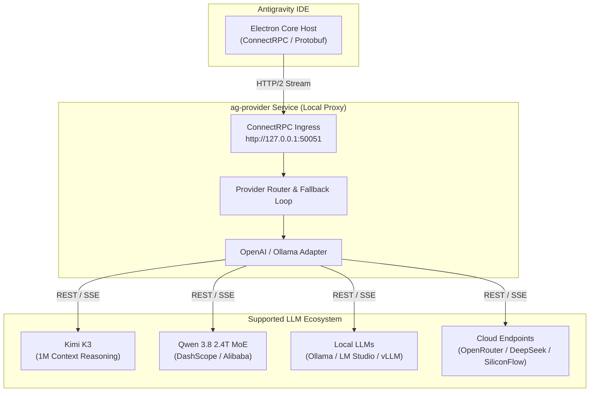

# Antigravity Universal AI Provider (`ag-provider`)

<p align="center">
  
  
  
  
</p>

<p align="center">
  <b>A lightweight, non-intrusive local compatibility proxy bridge for Antigravity IDE.</b><br />
  Connect any OpenAI-compatible AI backend (Kimi K3, Qwen 3.8 2.4T, Ollama, LM Studio, OpenRouter, DeepSeek, vLLM, SiliconFlow, Groq, GLM) to Antigravity IDE with zero binary patching, zero authentication bypass, and full security compliance.
</p>

---

## 🌟 Key Features

- **⚡ Zero Binary Modification**: Operates 100% out-of-band via standard configuration extensions (`antigravity.agentHostAddress`).
- **🔥 Cutting-Edge Model Support**: Direct integration for **Kimi K3** (1M Context reasoning) & **Qwen 3.8** (2.4 Trillion parameter MoE).
- **🔌 Universal OpenAI Adapter**: Translates ConnectRPC Protobuf streams to standard OpenAI `v1/chat/completions` API formats.
- **🔄 Resilient Fallback & Load Balancing**: Automatic failover to secondary providers on rate limits, network timeouts, or HTTP 5xx errors.
- **🏠 Offline & Local-First Support**: First-class integration with Ollama, LM Studio, llama.cpp, and vLLM.
- **📊 Real-time Telemetry & Health Dashboard**: Built-in web control panel for active model switching, memory usage, latency, and health tests.
- **🔒 Non-Destructive & Safe**: Preserves all native IDE licensing, authentication tokens, and workspace governance.

---

## 🏗️ System Architecture



---

## 🌌 Supported Providers & Engines

| Provider / Engine | Type | Default Endpoint | Supported Features |
| :--- | :--- | :--- | :--- |
| **Kimi K3 (Moonshot AI)** | Cloud API | `https://api.moonshot.ai/v1` | **1M Token Context**, Always-on reasoning |
| **Qwen 3.8 (DashScope)** | Cloud / MoE | `https://dashscope.aliyuncs.com/compatible-mode/v1` | **2.4 Trillion Parameters**, Flagship MoE Preview |
| **Ollama** | Local | `http://localhost:11434/v1` | Streaming, Local Code Models, Zero Cost |
| **LM Studio** | Local | `http://localhost:1234/v1` | GGUF Models, Offline Execution |
| **OpenRouter** | Cloud | `https://openrouter.ai/api/v1` | Multi-provider routing, Prompt Cache |
| **SiliconFlow** | Cloud | `https://api.siliconflow.cn/v1` | High-speed Qwen 2.5 Coder & DeepSeek V3/R1 |
| **DeepSeek** | Cloud | `https://api.deepseek.com/v1` | DeepSeek-V3, DeepSeek-R1 Reasoning |
| **vLLM / llama.cpp** | Self-Hosted | `http://localhost:8000/v1` | High-throughput batch inference |

---

## 🛠️ Quick Start Guide

### 1. Configuration (`providers.json`)

Configure your target model providers in `src/ag-provider/providers.json`:

```json
{
  "default": "kimi-k3",
  "fallback": ["qwen-3.8-max", "ollama-local"],
  "providers": [
    {
      "id": "kimi-k3",
      "name": "Kimi K3 (Moonshot AI - 1M Context)",
      "baseUrl": "https://api.moonshot.ai/v1",
      "apiKey": "${KIMI_API_KEY}",
      "model": "kimi-k3",
      "timeoutMs": 120000
    },
    {
      "id": "qwen-3.8-max",
      "name": "Qwen 3.8 (2.4T MoE - DashScope)",
      "baseUrl": "https://dashscope.aliyuncs.com/compatible-mode/v1",
      "apiKey": "${DASHSCOPE_API_KEY}",
      "model": "qwen3.8-max-preview",
      "timeoutMs": 120000
    }
  ]
}
```

---

## 📊 Health Check & Dashboard

- **Service Health Check**: `GET http://127.0.0.1:50051/health`
- **Interactive Control Panel**: `GET http://127.0.0.1:50051/dashboard`

---

## 📄 License

Distributed under the MIT License. See `LICENSE` for details.
