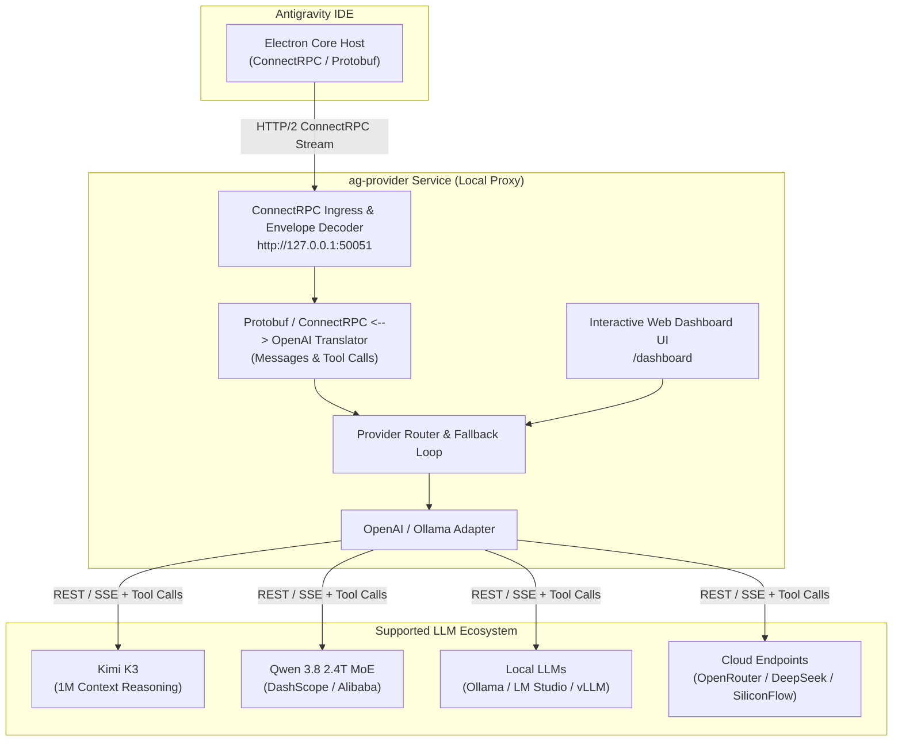

# Antigravity Universal AI Provider (`ag-provider`)

<p align="center">
  
  
  
  
  
</p>

<p align="center">
  <b>A lightweight, non-intrusive local compatibility proxy bridge for Antigravity IDE.</b><br />
  Connect any OpenAI-compatible AI backend (Kimi K3, Qwen 3.8 2.4T, Ollama, LM Studio, OpenRouter, DeepSeek, vLLM, SiliconFlow, Groq, GLM) to Antigravity IDE with zero binary patching, zero authentication bypass, and full security compliance.
</p>

---

## 🌟 Key Features

- **⚡ Zero Binary Modification**: Operates 100% out-of-band via standard configuration extensions (`antigravity.agentHostAddress`).
- **🔥 Flagship Model Support**: Built-in support for **Kimi K3** (1M Context reasoning) & **Qwen 3.8** (2.4 Trillion parameter MoE).
- **🛠️ Function Calling & Tool Calling Translation**: Bidirectional translation between ConnectRPC Protobuf `functionDeclarations` and OpenAI `tools` / `tool_calls` schemas.
- **🔌 ConnectRPC / Protobuf Binary Pipeline**: Native 5-byte header envelope decoding/encoding (`application/connect+proto`) to standard OpenAI `v1/chat/completions` API formats.
- **🔄 Resilient Fallback & Load Balancing**: Automatic failover to secondary providers on rate limits, network timeouts, or HTTP 5xx errors.
- **🏠 Offline & Local-First Support**: First-class integration with Ollama, LM Studio, llama.cpp, and vLLM.
- **📊 Interactive Web Dashboard UI**: Real-time control panel at `http://127.0.0.1:50051/dashboard` for live model switching, latency, memory usage, and health checks.
- **🔒 Non-Destructive & Safe**: Preserves all native IDE licensing, authentication tokens, and workspace governance.

---

## 🏗️ System Architecture



---

## 🌌 Supported Providers & Engines

| Provider / Engine | Type | Default Endpoint | Supported Features |
| :--- | :--- | :--- | :--- |
| **Kimi K3 (Moonshot AI)** | Cloud API | `https://api.moonshot.ai/v1` | **1M Token Context**, Always-on reasoning |
| **Qwen 3.8 (DashScope)** | Cloud / MoE | `https://dashscope.aliyuncs.com/compatible-mode/v1` | **2.4 Trillion Parameters**, Flagship MoE Preview |
| **Ollama** | Local | `http://localhost:11434/v1` | Streaming, Local Code Models, Zero Cost |
| **LM Studio** | Local | `http://localhost:1234/v1` | GGUF Models, Offline Execution |
| **OpenRouter** | Cloud | `https://openrouter.ai/api/v1` | Multi-provider routing, Prompt Cache |
| **SiliconFlow** | Cloud | `https://api.siliconflow.cn/v1` | High-speed Qwen 2.5 Coder & DeepSeek V3/R1 |
| **DeepSeek** | Cloud | `https://api.deepseek.com/v1` | DeepSeek-V3, DeepSeek-R1 Reasoning |
| **vLLM / llama.cpp** | Self-Hosted | `http://localhost:8000/v1` | High-throughput batch inference |

---

## 📂 Repository Layout

```
.
├── README.md               # Master Project Documentation & Status
├── implementation_plan.md  # Architectural Implementation Plan
├── walkthrough.md          # Implementation Walkthrough & Deliverables Summary
├── todo.md                 # Project Task Matrix
├── roadmap.md              # Long-term Feature Roadmap
├── docs/                   # Engineering Specifications
│   ├── architecture.md     # Electron IDE runtime & ConnectRPC internals
│   ├── providers.md        # Provider catalog & ILLMProvider TypeScript interfaces
│   ├── network.md          # Protocol buffers, wire schemas & headers
│   ├── bridge.md           # ag-provider system topology & translation engine
│   └── findings.md         # Summary of reverse engineering discoveries
└── src/
    └── ag-provider/        # Bridge Service Codebase (Node.js / TypeScript)
        ├── package.json
        ├── tsconfig.json
        ├── providers.json  # Runtime configuration template
        └── src/
            ├── index.ts        # Main HTTP/2 Server & API routes
            ├── adapters/       # ILLMProvider implementations (OpenAI, Ollama)
            ├── router/         # Provider router & fallback manager
            ├── translation/    # ConnectRPC decoders, encoders & toolsTranslation
            └── dashboard/      # Web control panel UI (dashboardHtml.ts)
```

---

## 🛠️ Quick Start Guide

### 1. Installation

Clone the repository and install dependencies:

```bash
git clone https://github.com/your-username/antigravity-universal-provider.git
cd antigravity-universal-provider/src/ag-provider
npm install
```

### 2. Configuration (`providers.json`)

Configure your target model providers in `src/ag-provider/providers.json`:

```json
{
  "default": "kimi-k3",
  "fallback": ["qwen-3.8-max", "ollama-local"],
  "providers": [
    {
      "id": "kimi-k3",
      "name": "Kimi K3 (Moonshot AI - 1M Context)",
      "baseUrl": "https://api.moonshot.ai/v1",
      "apiKey": "${KIMI_API_KEY}",
      "model": "kimi-k3",
      "timeoutMs": 120000
    },
    {
      "id": "qwen-3.8-max",
      "name": "Qwen 3.8 (2.4T MoE - DashScope)",
      "baseUrl": "https://dashscope.aliyuncs.com/compatible-mode/v1",
      "apiKey": "${DASHSCOPE_API_KEY}",
      "model": "qwen3.8-max-preview",
      "timeoutMs": 120000
    }
  ]
}
```

### 3. Launch the Proxy Server

```bash
# Set your API keys
export KIMI_API_KEY="your-kimi-key"
export DASHSCOPE_API_KEY="your-dashscope-key"

# Start the bridge server
npm run dev
```

The bridge server will listen on `http://127.0.0.1:50051`.

### 4. Connect Antigravity IDE

Open your Antigravity IDE settings (`settings.json`) and add the custom host configuration:

```json
{
  "antigravity.agentHostAddress": "http://127.0.0.1:50051"
}
```

---

## 📊 Health Check & Dashboard

- **Service Health Check**: `GET http://127.0.0.1:50051/health`
- **Interactive Control Panel**: `GET http://127.0.0.1:50051/dashboard`

---

## 🏷️ Tags

`dev` `ai` `reverse-engineering` `connectrpc` `openai-adapter` `ag-provider` `antigravity-ide` `ollama` `openrouter` `qwen` `deepseek` `kimi-k3` `tool-calling` `function-calling`

---

**Versão:** 1.3.0 | **Última Revisão:** 2026-07-25 11:46:00 -03:00
