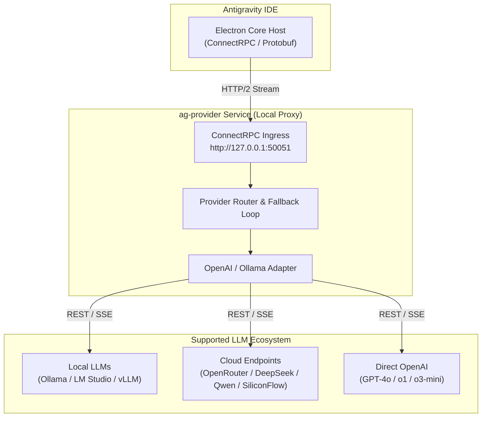

# Antigravity Universal AI Provider (`ag-provider`)

<p align="center">
  
  
  
  
</p>

<p align="center">
  <b>A lightweight, non-intrusive local compatibility proxy bridge for Antigravity IDE.</b><br />
  Connect any OpenAI-compatible AI backend (Ollama, LM Studio, OpenRouter, DeepSeek, Qwen, vLLM, SiliconFlow, Groq, Kimi, GLM) to Antigravity IDE with zero binary patching, zero authentication bypass, and full security compliance.
</p>

---

## 🌟 Key Features

- **⚡ Zero Binary Modification**: Operates 100% out-of-band via standard configuration extensions (`antigravity.agentHostAddress`).
- **🔌 Universal OpenAI Adapter**: Translates ConnectRPC Protobuf streams to standard OpenAI `v1/chat/completions` API formats.
- **🔄 Resilient Fallback & Load Balancing**: Automatic failover to secondary providers on rate limits, network timeouts, or HTTP 5xx errors.
- **🏠 Offline & Local-First Support**: First-class integration with Ollama, LM Studio, llama.cpp, and vLLM.
- **📊 Real-time Telemetry & Health Dashboard**: Built-in monitoring for memory usage, latency, active models, and token throughput.
- **🔒 Non-Destructive & Safe**: Preserves all native IDE licensing, authentication tokens, and workspace governance.

---

## 🏗️ System Architecture



---

## 🌌 Supported Providers & Engines

| Provider / Engine | Type | Default Endpoint | Supported Features |
| :--- | :--- | :--- | :--- |
| **Ollama** | Local | `http://localhost:11434/v1` | Streaming, Local Code Models, Zero Cost |
| **LM Studio** | Local | `http://localhost:1234/v1` | GGUF Models, Offline Execution |
| **OpenRouter** | Cloud | `https://openrouter.ai/api/v1` | Multi-provider routing, Prompt Cache |
| **SiliconFlow** | Cloud | `https://api.siliconflow.cn/v1` | High-speed Qwen 2.5 Coder & DeepSeek V3/R1 |
| **DeepSeek** | Cloud | `https://api.deepseek.com/v1` | DeepSeek-V3, DeepSeek-R1 Reasoning |
| **Qwen (DashScope)** | Cloud | `https://dashscope.aliyuncs.com/compatible-mode/v1` | Qwen 2.5 Coder models |
| **vLLM / llama.cpp** | Self-Hosted | `http://localhost:8000/v1` | High-throughput batch inference |
| **Groq / Together / Fireworks** | Cloud | Custom OpenAI Endpoint | Ultra-fast token generation |

---

## 📁 Repository Structure

```
.
├── README.md               # Master GitHub Documentation
├── LICENSE                 # Project License
├── docs/                   # Reverse Engineering & Architecture Specifications
│   ├── architecture.md     # Electron IDE runtime & ConnectRPC internals
│   ├── providers.md        # Provider catalog & ILLMProvider TypeScript interfaces
│   ├── network.md          # Protocol buffers, wire schemas & headers
│   ├── bridge.md           # ag-provider system topology & translation engine
│   └── findings.md         # Summary of reverse engineering discoveries
└── src/
    └── ag-provider/        # Bridge Service Codebase (Node.js / TypeScript)
        ├── package.json
        ├── tsconfig.json
        ├── providers.json  # Runtime configuration template
        └── src/
            ├── index.ts    # Main HTTP/2 Server & API routes
            ├── adapters/   # ILLMProvider implementations (OpenAI, Ollama)
            └── router/     # Provider router & fallback manager
```

---

## 🛠️ Quick Start Guide

### Prerequisites

- Node.js `>= 18.0.0`
- npm `>= 9.0.0`
- Antigravity IDE installed

### 1. Installation

Clone the repository and install dependencies:

```bash
git clone https://github.com/your-username/antigravity-universal-provider.git
cd antigravity-universal-provider/src/ag-provider
npm install
```

### 2. Configuration (`providers.json`)

Configure your target model providers in `src/ag-provider/providers.json`:

```json
{
  "default": "qwen-siliconflow",
  "fallback": ["ollama-local"],
  "providers": [
    {
      "id": "qwen-siliconflow",
      "name": "Qwen 2.5 Coder 32B (SiliconFlow)",
      "baseUrl": "https://api.siliconflow.cn/v1",
      "apiKey": "${SILICONFLOW_API_KEY}",
      "model": "Qwen/Qwen2.5-Coder-32B-Instruct",
      "timeoutMs": 60000
    },
    {
      "id": "ollama-local",
      "name": "Ollama Local (qwen2.5-coder)",
      "baseUrl": "http://localhost:11434/v1",
      "apiKey": "ollama",
      "model": "qwen2.5-coder:14b",
      "timeoutMs": 120000
    }
  ]
}
```

> **Note**: API keys supports environment variable expansion using `${ENV_VAR_NAME}` syntax.

### 3. Launch the Proxy Server

```bash
# Set your API keys
export SILICONFLOW_API_KEY="your-api-key"

# Start the bridge server
npm run dev
```

The bridge server will listen on `http://127.0.0.1:50051`.

### 4. Connect Antigravity IDE

Open your Antigravity IDE settings (`settings.json`) and add the custom host configuration:

```json
{
  "antigravity.agentHostAddress": "http://127.0.0.1:50051"
}
```

---

## 📊 Health Check & Monitoring

- **Service Health Check**: `GET http://127.0.0.1:50051/health`
- **Telemetry & Status Dashboard**: `GET http://127.0.0.1:50051/api/status`

Sample response:
```json
{
  "status": "online",
  "defaultProvider": "qwen-siliconflow",
  "metrics": {
    "uptimeSeconds": 1420,
    "memoryUsageMb": 38
  }
}
```

---

## 🛡️ Security & Compliance Disclaimer

This project is an independent interoperability tool designed solely to route AI inference calls to user-selected backends via public extension points. It does **not** bypass software licensing, remove authentication barriers, or modify proprietary application binaries.

---

## 📄 License

Distributed under the MIT License. See `LICENSE` for details.
