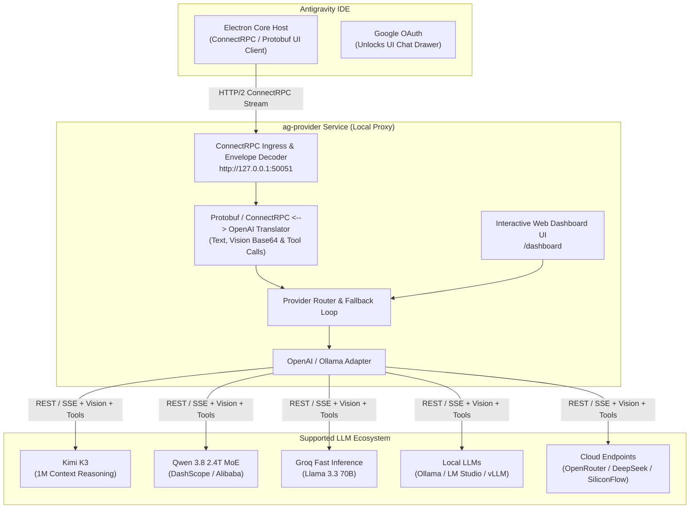

# Antigravity Universal AI Provider (`ag-provider`)

<p align="center">
  
  
  
  
  
</p>

<p align="center">
  <b>A lightweight, non-intrusive local compatibility proxy bridge for Antigravity IDE.</b><br />
  Connect any OpenAI-compatible AI backend (Kimi K3, Qwen 3.8 2.4T, Groq, Ollama, LM Studio, OpenRouter, DeepSeek, vLLM, SiliconFlow) to Antigravity IDE with zero binary patching, zero authentication bypass, and full security compliance.
</p>

---

## 🌟 Overview & Key Features

- **⚡ Zero Binary Modification**: Operates 100% out-of-band via standard configuration extensions (`antigravity.agentHostAddress` / `CLOUD_CODE_ENDPOINT`).
- **📖 Exhaustive Operation & Usage Manual**: Step-by-step setup, troubleshooting, and provider links in [`docs/user_manual.md`](./docs/user_manual.md).
- **🔒 Safe & Secure Key Management**: Full `.env` file integration with strict `.gitignore` rules—your API keys are never exposed or committed to GitHub.
- **🔑 Google Authentication & Traffic Redirection Explained**: Log in to Google to unlock the IDE chat UI, while **100% of LLM network traffic is redirected locally** to `ag-provider` on port `50051`.
- **🎛️ Live Dynamic Provider Switching**: Control active backend models on-the-fly via the Web Dashboard at `http://127.0.0.1:50051/dashboard` without restarting the IDE.
- **🔥 Flagship Model Support**: Out-of-the-box integration for **Kimi K3** (1M Context reasoning), **Qwen 3.8** (2.4T MoE), **Groq** (Llama 3.3 70B ultra-fast inference), and **Ollama Local**.
- **👁️ Multimodal / Vision Processing**: Intercepts ConnectRPC Protobuf `inlineData` Base64 images and converts them to standard OpenAI `image_url` payloads.
- **🛠️ Function & Tool Calling**: Bidirectional translation between ConnectRPC Protobuf `functionDeclarations` and OpenAI `tools` / `tool_calls` schemas.
- **🔄 Resilient Fallback Engine**: Automatic failover to secondary providers on rate limits, network timeouts, or HTTP 5xx errors.

---

## 🔑 How Google Login & Local Routing Work

> [!IMPORTANT]
> **Why is Google Login required by Antigravity IDE?**
> The IDE drawer and chat user interface are locked until a user signs in with a Google account. However, setting `$env:CLOUD_CODE_ENDPOINT = "http://127.0.0.1:50051"` or `"antigravity.agentHostAddress": "http://127.0.0.1:50051"` instructs the IDE's ConnectRPC client to route **all AI requests to `ag-provider` locally**. Your requests **never** hit Google AI servers, consume Google quota, or send your prompt data to Google.

### Model Selection: IDE Dropdown vs. Web Dashboard

- **In Antigravity IDE Chat**: You can leave any model selected in the IDE dropdown (e.g. *Gemini 3.6 Flash*). This operates purely as a visual interface.
- **In `ag-provider` Web Dashboard (`http://127.0.0.1:50051/dashboard`)**: This is where the actual LLM engine is controlled. Switching active providers in the Dashboard immediately updates the backend model that responds in the IDE.

---

## 🏗️ System Architecture



---

## 🌌 Supported Providers & Official API Key Sources

| Provider / Engine | Type | Default Model | Environment Key | Official API Key Link |
| :--- | :--- | :--- | :--- | :--- |
| **Kimi K3 (Moonshot AI)** | Cloud API | `kimi-k3` | `KIMI_API_KEY` | [Moonshot Platform Console](https://platform.moonshot.cn/) |
| **Qwen 3.8 / Max (DashScope)** | Cloud / MoE | `qwen3.8-max-preview` | `DASHSCOPE_API_KEY` | [Alibaba DashScope Console](https://dashscope.aliyun.com/) |
| **Groq Ultra-Fast** | Cloud API | `llama-3.3-70b-versatile` | `GROQ_API_KEY` | [Groq Cloud Console](https://console.groq.com/keys) |
| **SiliconFlow** | Cloud API | `Qwen/Qwen2.5-Coder-32B-Instruct` | `SILICONFLOW_API_KEY` | [SiliconFlow Dashboard](https://cloud.siliconflow.cn/) |
| **OpenRouter** | Cloud Router | `qwen/qwen-2.5-coder-32b-instruct` | `OPENROUTER_API_KEY` | [OpenRouter Keys Page](https://openrouter.ai/keys) |
| **DeepSeek** | Cloud API | `deepseek-chat` / `deepseek-reasoner` | `DEEPSEEK_API_KEY` | [DeepSeek Platform](https://platform.deepseek.com/) |
| **Ollama Local** | Local | `qwen2.5-coder:14b` | *None (Local)* | [Ollama Official Site](https://ollama.com/) |
| **LM Studio** | Local | `local-model` | *None (Local)* | [LM Studio Site](https://lmstudio.ai/) |

---

## 📂 Repository Layout

```
.
├── README.md               # Master Project Overview & Setup Guide
├── implementation_plan.md  # Architectural Implementation Plan
├── walkthrough.md          # Implementation Walkthrough & Deliverables Summary
├── todo.md                 # Project Task Matrix
├── roadmap.md              # Long-term Feature Roadmap
├── docs/                   # Engineering Specifications & Detailed Guides
│   ├── user_manual.md      # Detailed Step-by-Step Operation & Usage Manual
│   ├── architecture.md     # Electron IDE runtime & ConnectRPC internals
│   ├── providers.md        # Provider catalog & ILLMProvider TypeScript interfaces
│   ├── network.md          # Protocol buffers, wire schemas & headers
│   ├── bridge.md           # ag-provider system topology & translation engine
│   └── findings.md         # Summary of reverse engineering discoveries
└── src/
    └── ag-provider/        # Local Proxy Bridge Codebase (Node.js / TypeScript)
        ├── package.json
        ├── tsconfig.json
        ├── .env            # Private local environment variables (Git ignored)
        ├── providers.json  # Runtime configuration template
        └── src/
            ├── index.ts        # Main HTTP/2 Server & API routes
            ├── adapters/       # ILLMProvider implementations (OpenAI, Ollama)
            ├── router/         # Provider router & fallback manager
            ├── translation/    # ConnectRPC decoders, encoders, vision & tools
            └── dashboard/      # Web control panel UI (dashboardHtml.ts)
```

---

## 🛠️ Quick Start Guide

For full step-by-step instructions, view the [**Exhaustive Operation & Usage Manual**](./docs/user_manual.md).

### 1. Configure `.env` File (Secure Key Management)

Navigate to `src/ag-provider` and create a `.env` file:

```env
KIMI_API_KEY=sk-your-kimi-key
DASHSCOPE_API_KEY=sk-your-dashscope-key
GROQ_API_KEY=gsk_your-groq-key
SILICONFLOW_API_KEY=sk-your-siliconflow-key
OPENROUTER_API_KEY=sk-or-v1-your-openrouter-key
```

### 2. Build & Launch Proxy Server

```powershell
cd E:\00Dev\AntigravityUnlock\src\ag-provider
npm install
npm run build
npm start
```

You should see:
```text
=======================================================
  Antigravity Universal AI Provider Bridge (ag-provider) 
  Control Panel: http://127.0.0.1:50051/dashboard
  Running on http://127.0.0.1:50051
=======================================================
```

### 3. Launch Antigravity IDE pointed to Local Proxy

In a new PowerShell window:

```powershell
$env:CLOUD_CODE_ENDPOINT = "http://127.0.0.1:50051"
$env:CODEIUM_CLOUD_CODE_ENDPOINT = "http://127.0.0.1:50051"
Start-Process "$env:LOCALAPPDATA\Programs\Antigravity IDE\Antigravity IDE.exe" -ArgumentList "--user-data-dir=`"E:\00Dev\AntigravityUnlock\.test-ide-profile`"","--new-window"
```

---

## 📊 Health Check & Dashboard

- **Service Health Check**: `GET http://127.0.0.1:50051/health`
- **Interactive Control Panel**: `GET http://127.0.0.1:50051/dashboard`

---

## 🏷️ Tags

`dev` `ai` `reverse-engineering` `connectrpc` `openai-adapter` `ag-provider` `antigravity-ide` `ollama` `openrouter` `qwen` `deepseek` `kimi-k3` `groq` `tool-calling` `vision` `user-manual`

---

**Versão:** 1.5.0 | **Última Revisão:** 2026-07-27 00:10:00 -03:00
