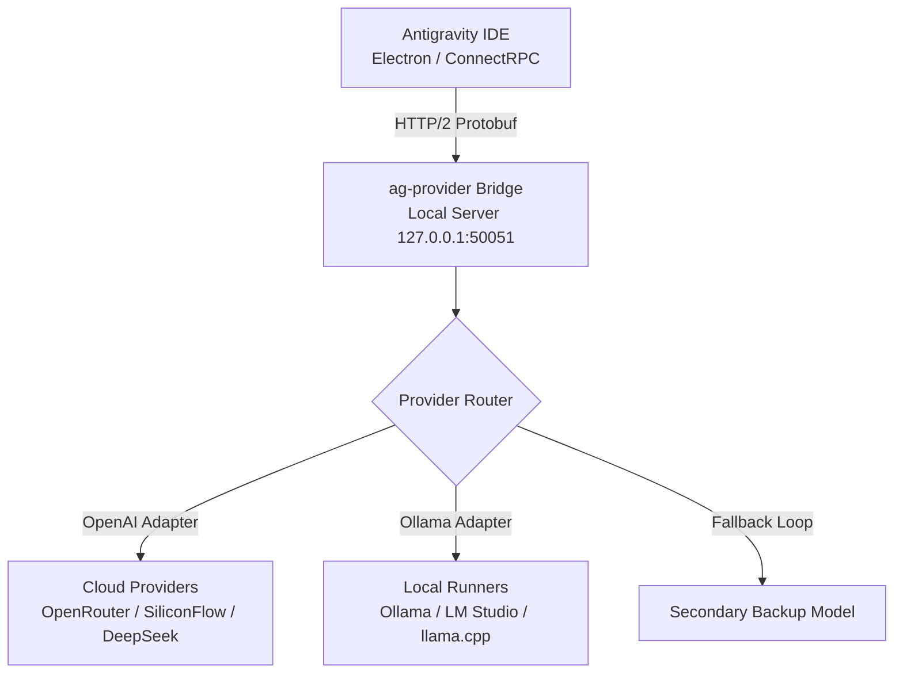

# 🚀 Antigravity Universal AI Provider (`ag-provider`)

[](file:///E:/00Dev/agent%20skills%20e%20mais%20prod/ESTRUTURA_DOMINIOS.md)
[]()
[]()
[]()
[]()

> **Camada de compatibilidade e ponte universal (`ag-provider`) para o Antigravity IDE, permitindo conectar qualquer backend de linguagem compatível com a API OpenAI (Ollama, LM Studio, OpenRouter, DeepSeek, Qwen, vLLM, SiliconFlow, Groq, Kimi, GLM, etc.) sem alterar mecanismos de segurança, licenciamento ou autenticação originais do IDE.**

---

## 🎯 Objetivo

O **Antigravity Universal AI Provider** realiza a ponte entre o **Antigravity IDE** (VS Code fork rodando sobre Electron e ConnectRPC) e provedores arbitrários de modelos de linguagem. 

### 🛡️ Princípios Inegociáveis
- **Não Destrutivo**: NENHUM executável ou DLL do IDE é modificado ou patchado.
- **Reversível**: Todo o ecossistema opera através de pontos de extensão oficiais (`antigravity.agentHostAddress`).
- **Segurança Preservada**: Autenticação, licenciamento e governança permanecem intactos.

---

## 🏛️ Arquitetura do Sistema



---

## 📂 Inventário & Estrutura de Documentos

Seguindo o padrão de **Estrutura Transversal de Domínios** (`E:\00Dev\agent skills e mais prod\ESTRUTURA_DOMINIOS.md`), este repositório é composto por relatórios técnicos especializados e pelo código-fonte da ponte local:

```markdown
E:/00Dev/AntigravityUnlock/
│
├── 📜 README.md                 # Visão geral e guia mestre do projeto (este arquivo)
├── 📋 Blueprint.md              # Especificação de requisitos e objetivos iniciais
├── 📋 implementation_plan.md    # Plano técnico de execução aprovado
├── 📑 architecture.md           # Engenharia reversa da arquitetura do IDE e runtime Electron
├── 📑 providers.md              # Matriz de provedores suportados e especificação ILLMProvider
├── 📑 network.md                # Engenharia do protocolo ConnectRPC, Protobuf e headers
├── 📑 bridge.md                 # Design do processo proxy intermediário (ag-provider)
├── 📑 findings.md               # Relatório consolidado das descobertas
├── 📑 todo.md                   # Checklist de fases e status de execução
├── 📑 roadmap.md                # Plano de evolução e próximos lançamentos
├── 📑 walkthrough.md            # Resumo de entregas e guia de validação
│
└── 🧩 src/
    └── ag-provider/            # Serviço local da ponte TypeScript/Node.js
        ├── package.json
        ├── tsconfig.json
        ├── providers.json      # Configuração dos endpoints e chaves de API
        └── src/
            ├── index.ts        # Servidor HTTP/2 e rotas da API Proxy
            ├── config.ts       # Carregador de configurações
            ├── adapters/
            │   ├── base.ts     # Interface ILLMProvider e tipos unificados
            │   ├── openai.ts   # Adaptador para OpenRouter/SiliconFlow/DeepSeek/OpenAI
            │   └── ollama.ts   # Adaptador para executores locais (Ollama/LM Studio)
            └── router/
                └── providerRouter.ts # Roteamento dinâmico e fallback resiliente
```

---

## 🌐 Provedores Suportados

| Provedor | Modelo de Acesso | Endpoint Padrão | Funcionalidades |
| :--- | :--- | :--- | :--- |
| **Ollama** | Local | `http://localhost:11434/v1` | Execução offline, 0 latência de rede |
| **LM Studio** | Local | `http://localhost:1234/v1` | Interface gráfica local, suporte GGUF |
| **OpenRouter** | Cloud Router | `https://openrouter.ai/api/v1` | Multi-provedor, prompt cache |
| **SiliconFlow** | Cloud API | `https://api.siliconflow.cn/v1` | Alta velocidade Qwen 2.5 Coder / DeepSeek |
| **DeepSeek** | Cloud API | `https://api.deepseek.com/v1` | Modelos de raciocínio V3 & R1 |
| **OpenAI** | Cloud API | `https://api.openai.com/v1` | Modelos GPT-4o, o1, o3-mini |
| **llama.cpp / vLLM** | Local / Self-Hosted | `http://localhost:8000/v1` | Alto throughput e inferência em lote |

---

## ⚙️ Configuração (`providers.json`)

Edite o arquivo [`src/ag-provider/providers.json`](file:///E:/00Dev/AntigravityUnlock/src/ag-provider/providers.json) para definir o modelo padrão e suas regras de fallback:

```json
{
  "default": "qwen-siliconflow",
  "fallback": ["ollama-local"],
  "providers": [
    {
      "id": "qwen-siliconflow",
      "name": "Qwen 2.5 Coder 32B (SiliconFlow)",
      "baseUrl": "https://api.siliconflow.cn/v1",
      "apiKey": "${SILICONFLOW_API_KEY}",
      "model": "Qwen/Qwen2.5-Coder-32B-Instruct",
      "timeoutMs": 60000
    },
    {
      "id": "ollama-local",
      "name": "Ollama Local (qwen2.5-coder)",
      "baseUrl": "http://localhost:11434/v1",
      "apiKey": "ollama",
      "model": "qwen2.5-coder:14b",
      "timeoutMs": 120000
    }
  ]
}
```

---

## 🚀 Como Executar

### 1. Iniciar a Ponte `ag-provider`

```bash
cd E:\00Dev\AntigravityUnlock\src\ag-provider
npm install
npm run dev
```

O servidor da ponte será iniciado em `http://127.0.0.1:50051`.

### 2. Conectar o Antigravity IDE

Adicione a seguinte linha nas configurações (`settings.json`) do Antigravity IDE:

```json
"antigravity.agentHostAddress": "http://127.0.0.1:50051"
```

### 3. Verificar Telemetria & Status

Acesse no seu navegador ou via curl:
- **Healthcheck**: `http://127.0.0.1:50051/health`
- **Dashboard de Status**: `http://127.0.0.1:50051/api/status`

---

## 🔗 Referências Cruzadas

- [Estrutura de Domínios Transversais](file:///E:/00Dev/agent%20skills%20e%20mais%20prod/ESTRUTURA_DOMINIOS.md)
- [Relatório de Arquitetura (`architecture.md`)](file:///E:/00Dev/AntigravityUnlock/architecture.md)
- [Especificação de Provedores (`providers.md`)](file:///E:/00Dev/AntigravityUnlock/providers.md)
- [Especificação de Rede (`network.md`)](file:///E:/00Dev/AntigravityUnlock/network.md)
- [Design da Ponte (`bridge.md`)](file:///E:/00Dev/AntigravityUnlock/bridge.md)

---

## 🏷️ Tags

`dev` `ai` `reverse-engineering` `connectrpc` `openai-adapter` `ag-provider` `antigravity-ide` `ollama` `openrouter` `qwen` `deepseek`
